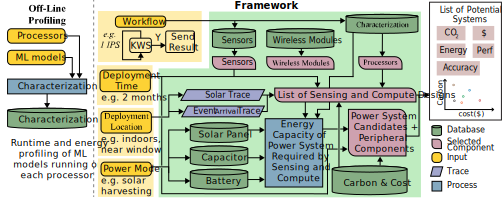

# MicroGreen

MicroGreen, a design space exploration framework for sustainable edge devices. MicroGreen integrates embodied-carbon modeling, workload characterization, and environment-dependent operational analysis. It incorporates parametric embodied-carbon models for MCUs, sensors, regulators, storage, batteries, capacitors, and solar panels, leveraging LCA databases. Using these models, MicroGreen takes as input application requirements (e.g., workload, duty cycle, deployment lifetime) and environmental traces (e.g., solar availability) and identifies carbon-optimal configurations. We empirically characterize a repository of MCUs under diverse workloads, integrate peripheral and power-source options, and generate Pareto-optimal designs to illustrate trade-offs between carbon footprint, performance, and cost



---
### Setup

 
1. **Clone the repository** with all submodules:
 
```bash
git clone --recurse-submodules git@github.com:S4AI-CornellTech/MicroGreen.git
cd MicroGreen
```
 
2. **Install Python dependencies** using the setup script:
 
```bash
bash setup.sh
```

---

## Repository Structure

- `framework/`: Core MicroGreen framework and Streamlit UI
- `profiling/`: Hardware profiling code and setup instructions
- `database/`: Precomputed embodied carbon and profiling results
- `EmbodiedCarbonModeling/`: Embodied carbon modeling submodule

---
### Reproducing Key Result Figures in MicroGren

Figure 3 - Board Carbon Breakdown 
```bash
python3 scripts/carbon_component_composition_plotter.py
```
Figure 5 - Per Inference Runtime and Energy Plot
```bash
python3 scripts/characterization_fig.py
```
Figure 6 - Carbon Rank Plot
```bash
python3 scripts/overall_eval_carbon.py --lifetime-years 1 --solar-panel-area-cap 611
```
Figure 7 - Irradiance Analysis Plot
```bash
python3 framework/main.py --workload kws-l --solar-plot
```
Figure 8 - Battery Analysis Plot
```bash
python3 framework/main.py --workload kws-s --battery-plot
```
Figure 10 - Hybrid Analysis Plot
```bash
python3 framework/main.py --workload kws-l --lifetime-plot
```
Figure 13
```bash
python3 framework/heterogeneousDeployment.py
python3 scripts/case_study_plot.py
```
---
 
## Carbon Modeling Verification
 
The embodied carbon estimates in `database/board_carbon.csv` are derived from the `EmbodiedCarbonModeling/` submodule. To regenerate the database from the modeling outputs, run:
 
```bash
python3 scripts/board_carbon_csv_generator.py \
  EmbodiedCarbonModeling/outputs/coralDevMicro_output \
  EmbodiedCarbonModeling/outputs/ESP32_output \
  EmbodiedCarbonModeling/outputs/ESP32-C6_output \
  EmbodiedCarbonModeling/outputs/ESP32-S3_output \
  EmbodiedCarbonModeling/outputs/nRF52840_output \
  EmbodiedCarbonModeling/outputs/RP2040_output \
  EmbodiedCarbonModeling/outputs/RP2350_output \
  EmbodiedCarbonModeling/outputs/STM32F411_output \
  -o database/board_carbon.csv
```
 
For detailed instructions on running the full embodied carbon modeling pipeline and hardware profiling, refer to the `README.md` files in the `EmbodiedCarbonModeling/` and `profiling/` directories respectively.

---

## Profiling Verification

The profiling results in `database/` contain per-MCU inference latency and power measurements collected using the hardware setup described in the paper. To verify or regenerate profiling results for a specific MCU, refer to the `GUIDELINE.md` or `README.md` in the `profiling/` directory for step-by-step instructions on environment setup, compilation, flashing, and power measurement.

---

### License

This project is licensed under the MIT License. See the LICENSE file for full details.