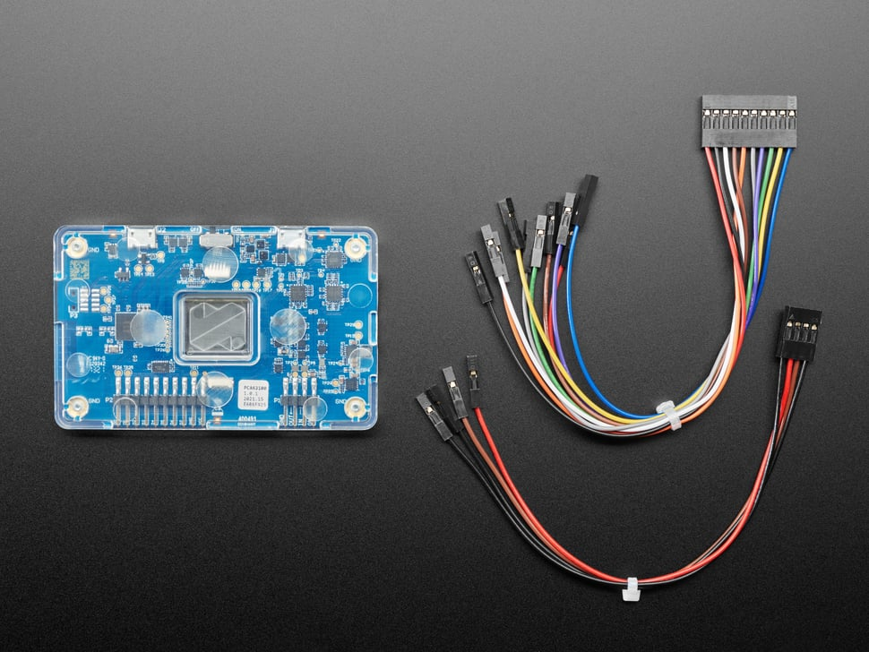

# Power Profiling with the Nordic Power Profiler Kit II (PPK2)

A guide to measuring power consumption on MCUs using the Nordic PPK2.

---

## What is the PPK2?

The Power Profiler Kit II (PPK2) by Nordic Semiconductor is a standalone current measurement tool that can measure currents from 200 nA to 1 A with high resolution. 

---

## Hardware Requirements

- Nordic Power Profiler Kit II (PPK2)
- MCU as DUT
- 1x Micro USB cables 
- Jumper wires (included with PPK2)
- Computer with macOS, Windows, or Linux

---

## 1. Install nRF Connect for Desktop

The PPK2 is controlled through Nordic's **nRF Connect for Desktop** app.

1. Download from: https://www.nordicsemi.com/Products/Development-tools/nRF-Connect-for-Desktop
2. Install and launch the application
3. In the app, find **Power Profiler** in the apps list and click **Install**
4. Once installed, click **Open**

> **Note:** On first launch, the app may prompt you to update the PPK2 firmware. Follow the on-screen instructions to update, then reboot your computer if the device is no longer recognized.

---

## 2. Connect the PPK2 to Your Computer

1. Connect the PPK2 to your computer using the **USB DATA/POWER** port (not the POWER ONLY port)
2. Flip the power switch on the PPK2 to **ON**
3. The RGB LED should pulse **green** — this means it is in standby and ready to connect

> If the device does not appear in the software, check that the switch is ON, try a different USB cable, or reboot your computer.

---

## 3. Wire the PPK2 to the different MCUs
In Source Meter mode, the PPK2 supplies power to the MCU and measures current at the same time. The MCU must **not** be powered via its own USB cable during this measurement.

### Connections

| PPK2 Pin | Pico Pin | Pico 2 Pin | ESP32 | ESP32-C6 | ESP32-S3 | 
|---|---|---| ---| ---| ---|
| **VOUT** | **3V3**  | **3V3** | **3V3** | **3V3** | **3V3** | 
| **GND** | **GND** | **GND** | **GND** | **GND** | **GND** |

> **Important:** Do NOT connect the MCU's USB cable while measuring in Source Meter mode, as this will bypass the PPK2 and skew measurements.

for nRD52840-DK, use PPK II power profiler as an ampere meter and follow the wiring documented here: https://docs.nordicsemi.com/bundle/ug_nrf52840_dk/page/UG/dk/hw_measure_ampmeter.html

---

## 4. Configure the Power Profiler App

1. Launch **nRF Connect for Desktop** → Open **Power Profiler**
2. Click **Select Device** in the top left and choose your PPK2
3. Select **Source meter** mode from the mode dropdown
4. Set the supply voltage to match your target (e.g. **3.3V** for the Pico 2)
5. Set the sample rate — **100 kHz** gives the highest resolution; lower rates suit longer captures
6. Click **Enable power output** to begin supplying power to the Pico

The Pico will boot and begin running your program. You should see current draw appear in the graph.

---

## 5. Take a Measurement

1. Click **Start** to begin recording
2. The LED on the PPK2 will turn **red** (source mode active)
3. Observe the real-time current graph as the Pico runs your program
4. Let it run through the behaviors you want to profile (e.g. active inference, sleep cycles)
5. Click **Stop** when done

### Reading the Graph

- The **blue line** shows instantaneous current
- Use the **average window** to highlight a region and see average current and energy
- Zoom in on spikes to see millisecond-level detail

---

## 6. Measure Sleep vs Active Current

To compare active and sleep power consumption on the MCU:

1. Start recording before the MCU enters a sleep cycle
2. Observe the drop in current when the sleep function runs
3. Select the sleep region in the graph and note the average current
4. Select the active/inference region and note the average current

---

## 7. Export Data

To save your measurement for post-processing:

1. Click the **Export** button in the Power Profiler app
2. Choose CSV format
3. The file contains timestamped current samples that can be analyzed in Python, Excel, or any data tool

---

## Troubleshooting

| Problem | Likely Cause | Fix |
|---|---|---|
| PPK2 not detected in app | Wrong USB port or switch off | Use USB DATA/POWER port, ensure switch is ON |
| No current shown | Pico also connected via USB | Disconnect Pico's USB cable during measurement |
| Firmware update prompt | Outdated PPK2 firmware | Follow on-screen update, reboot if needed |
| Very noisy signal | Long or loose jumper wires | Use short, secure connections |
| App crashes or freezes | nRF Connect install incomplete | Reinstall, ensure J-Link component is installed |

---

## LED Status Reference

| LED Color | Meaning |
|---|---|
| Pulsing green | Standby — ready to connect |
| Red | Source meter mode active |
| Blue | Ampere meter mode active |

---

## Tutorial Videos

### EYE on NPI — Nordic Power Profiler Kit II (Recommended)
A detailed walkthrough of the PPK2 hardware, modes, wiring, and the Power Profiler software:

▶ https://www.youtube.com/watch?v=60q8QCiYhjc

---

## References

- [PPK2 Product Page](https://www.nordicsemi.com/Products/Development-hardware/Power-Profiler-Kit-2)
- [PPK2 on Adafruit](https://www.adafruit.com/product/5048)
- [PPK2 User Guide (PDF)](https://docs.nordicsemi.com/bundle/ug_ppk2/page/UG/ppk/PPK_user_guide_Intro.html)
- [nRF Connect for Desktop](https://www.nordicsemi.com/Products/Development-tools/nRF-Connect-for-Desktop)